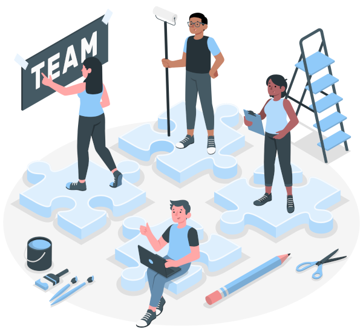

Building Research Dream Teams
=============================

**How to build team science and how to collaborate with not so obvious others?**

`People illustrations by Storyset <https://storyset.com/people>`_

.. list-table::

   * - Source
     - .. image:: https://zenodo.org/badge/668600449.svg
          :target: https://zenodo.org/doi/10.5281/zenodo.10074659
   * - Document
     - .. image:: https://zenodo.org/badge/DOI/10.5281/zenodo.10075225.svg
          :target: https://doi.org/10.5281/zenodo.10075225

About the Toolkit
-----------------

In recent years, there has been an increased perception of the potential for
interdisciplinary and collaborative research to address complex societal and
environmental needs. It is also becoming increasingly clear that a diversity
of roles and contributions is needed to drive progress and success in research
and innovation. The knowledge sector is now looking towards a team-based
approach bringing together more overtly diverse team members with specific
skills in funding, research design, data analysis, data management, software
development, research ethics, dealing with business, communications, etc.

What does this new thinking mean in practice? What skills are needed to
successfully carry out research today? How are different teams composed,
managed and rewarded? Can research morph from a sector where only ‘star
researchers’ are appreciated to one where everyone, including professional
support staff, is recognised for their skills and contributions?

**This toolkit helps put together and organise a workshop that explores what a
dream research team might look like and discuss what this might mean for how
research is supported, managed and rewarded.**

The toolkit is for anyone who would like to facilitate discussion and raise
awareness about diversity of roles and contributions to research in an
inclusive and interactive way.

How to use the toolkit?
-----------------------

The toolkit is designed as an online interactive document that is available at
`<https://research-dream-team-toolkit.readthedocs.io/>`_

The toolkit provides guidance and useful suggestions to design a workshop on
building research dream teams in a tailored manner to your audience, and to
organise it in an easy and efficient manner.

It is composed of the following sections:

* `About the toolkit`_: Description of the toolkit.

* `Goals and possible outcomes`_: Goals and possible outcomes of the workshop.

* `Practicalities`_: Information about specific organisational aspects related
  to this workshop.

* `Agenda`_: An actionable and re-usable workshop agenda, with some practical
  tips, which you might use to support your own workshop.

* `Scenario`_: A possible fictional research project (a scenario) to support
  the discussion on the composition of the ideal research team, with some
  insights to help you develop alternative scenarios to suit your needs, and
  guidance for facilitating the discussion.

* `Activity`_: A step by step explanation of the workshop activity.

* `Slide Deck`_: Presentation template which you can use to introduce the
  workshop, the scenario and the breakout activities

* `Activity Sheet`_: Printout copy of an activity sheet that each breakout
  group can use to facilitate their discussion.

You can use the toolkit simply by following sections and applying the provided
tips and suggestions.

How to collaborate and contribute?
----------------------------------

If you decide to run a similar workshop, we would love to hear from you. We
invite you to share your own experiences and materials with the community. We
all benefit from each other's resources and experiences. Through collaboration
we can keep improving these materials.

That's why we chose to host the toolkit on GitHub to make sure that anyone can
easily build on and further develop the toolkit. You can contribute as little
or as much as you want. You can start by making a comment on the resources,
sharing your observations and experiences, improving the materials we have
already made available, adding your own materials (for example, your own
slides, new scenarios, modified agendas) or starting a discussion.

The toolkit is written in `reStructuredText`_, which is an easy-to-read,
what-you-see-is-what-you-get plain text markup syntax. `Sphinx`_ is used to
generate the documentation. You can find useful information about how to use
reStructuredText and Sphinx at `Sublime and Sphinx Guide`_.

You can find the content of the toolkit at the `source <source>`_ folder of
this repository, which is a good starting point to see what you can contribute.

To build the documentation from the source files, you can simply use the
:code:`make` script:

.. code-block:: language

   make clean
   make html

The built of the latest version of the documentation is available at
`<https://research-dream-team-toolkit.readthedocs.io/en/latest/>`_.

.. _About the toolkit: https://research-dream-team-toolkit.readthedocs.io/en/latest/about.html
.. _Goals and possible outcomes: https://research-dream-team-toolkit.readthedocs.io/en/latest/goals.html
.. _Practicalities: https://research-dream-team-toolkit.readthedocs.io/en/latest/practicalities.html
.. _Agenda: https://research-dream-team-toolkit.readthedocs.io/en/latest/agenda.html
.. _Scenario: https://research-dream-team-toolkit.readthedocs.io/en/latest/scenario.html
.. _Activity: https://research-dream-team-toolkit.readthedocs.io/en/latest/activity.html
.. _Slide Deck: https://research-dream-team-toolkit.readthedocs.io/en/latest/slide_deck.html
.. _Activity Sheet: https://research-dream-team-toolkit.readthedocs.io/en/latest/activity_sheet.html
.. _reStructuredText: https://docutils.sourceforge.io/rst.html
.. _Sphinx: https://www.sphinx-doc.org/en/master/
.. _Sublime and Sphinx Guide: https://sublime-and-sphinx-guide.readthedocs.io/en/latest/index.html

Authors
-------

*(In alphabetic order)*

.. list-table::

   * - Cath Cotton
     - Conceptualisation, design of the workshop, delivery of the workshop.
     - c.m.cotton@tudelft.nl
   * - Kenny Meesters
     - Conceptualisation, design of the workshop, delivery of the workshop.
     - k.meesters@gmail.com
   * - Maria Cruz
     - Conceptualisation, design of the workshop, delivery of the workshop,
       design of the kit, development of the kit, team leadership and
       organisation.
     - m.cruz@nwo.nl
   * - Marta Teperek
     - Conceptualisation, design of the workshop, delivery of the workshop,
       design of the kit, development of the kit, team leadership and
       organisation.
     - martateperek@googlemail.com
   * - Melanie Imming
     - Conceptualisation, design of the workshop, design of the kit, development
       of the kit, team leadership and organisation.
     - immingimpact@gmail.com
   * - Natalia Romero Herrera
     - Conceptualisation, design of the workshop, delivery of the workshop.
     - n.a.romero@tudelft.nl
   * - Serkan Girgin
     - Conceptualisation, design of the workshop, delivery of the workshop,
       design of the kit, development of the kit, Sphinx implementation.
     - s.girgin@utwente.nl
   * - Yan Wang
     - Conceptualisation, design of the workshop, delivery of the workshop,
       design of the kit, development of the kit, team leadership and
       organisation.
     - y.wang-16@tudelft.nl

.. |orcid-icon| image:: https://info.orcid.org/wp-content/uploads/2019/11/orcid_16x16.png
